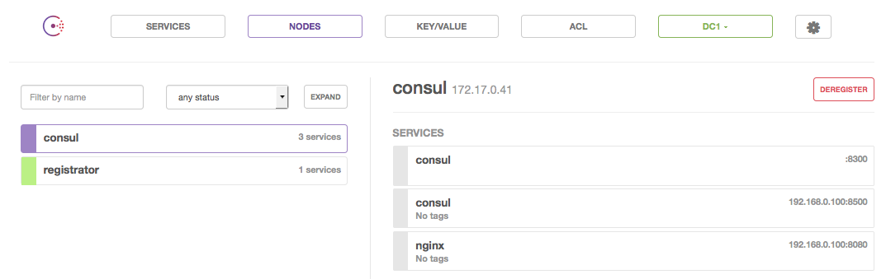

# docker-registrator
QNIBTerminal image holding registrator.

## Hello World

Fire up the stack

```
$ docker-compose up -d
Creating dockerregistrator_consul_1...
Creating dockerregistrator_registrator_1...
$
```

This will give you two consul nodes `registrator` and `consul`. The node `consul` also gets all the services attached via `registrator`, that's why `consul` got two times the service consul.


- `8300` is given by the internal consul-check within the `consul` container
- `8500` is give to `consul` since the port 8500 is exposed

## Fire up container

By firing up a new container

```
$ docker run -d -p 8080:80 qnib/nginx
2c1bcc6bed08a1f8560469cc5aaa31952cf310ddbc31fedcaad51bf656a4eb75
```
registrator gets the message

```
[root@registrator /]# tail -n1 /var/log/supervisor/registrator.log
2015/10/28 15:50:25 added: 2c1bcc6bed08 registrator:fervent_babbage:80
```
and adds the service to `consul`




### Controlling registrator

Since the compose file provides an external IP to advertise

```
registrator:
   *snip*
    environment:
     - REGISTRATOR_ADDV_IP=192.168.0.100
```

The external port `8080` alongside with the provides IP `192.168.0.100` is used.


Changing the flag to use the internal IP 

```
registrator:
   *snip*
    environment:
     - REGISTRATOR_INTERAL_IP=true
```
comes down to the internal IP of the container `qnib/nginx` and his internal port `80`.


If none of it is given

```
registrator:
   *snip*
#    environment:
#     - REGISTRATOR_INTERAL_IP=true
#     - REGISTRATOR_ADDV_IP=192.168.0.100
```

the internal IP of the `consul` container and the external port of the service (`8080`) will be attached


Which might make the least sense... (at least after thinking 1min about it) :)
